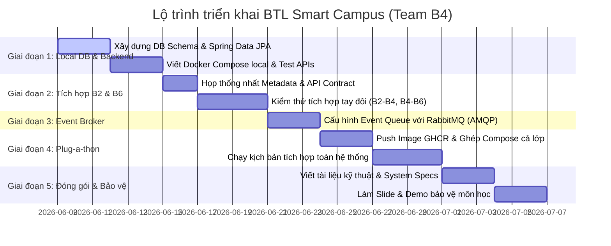

# Lộ trình kế hoạch chi tiết: Từ hiện tại đến khi hoàn thành Bài tập lớn (BTL) - AI Vision Service (Team B4)

Tài liệu này vạch ra lộ trình thực hiện toàn diện từng bước từ trạng thái hiện tại (hoàn thành Lab 4) cho đến khi ghép nối hệ thống toàn khóa và báo cáo kết thúc môn học **Dịch vụ kết nối và công nghệ nền tảng (FIT4110)**.

---

## Tóm tắt các giai đoạn triển khai



---

## CHI TIẾT TỪNG BƯỚC THỰC HIỆN

### GIAI ĐOẠN 1: Phát triển Backend & Cơ sở dữ liệu cục bộ (Đã hoàn thành)
**Mục tiêu:** Phát triển API backend và tích hợp Database PostgreSQL thực tế, đóng gói Docker Compose và kiểm thử độc lập.
*   **Trạng thái:** `[x] HOÀN THÀNH`

*   **Bước 1.1: Thiết lập Database Schema (PostgreSQL):**
    *   Sử dụng cơ sở dữ liệu PostgreSQL 15-alpine.
    *   Tạo các bảng cơ sở dữ liệu thông qua **Spring Data JPA & Hibernate** mapping:
        *   `detections` (Lưu sự kiện nhận diện chung: ID camera, URL ảnh, mã vùng, thời điểm nhận diện, trạng thái xử lý).
        *   `detected_objects` (Vật thể chi tiết có tọa độ hộp bao bounding box: PERSON, VEHICLE, HELMET, FACE, FIRE, SMOKE).
        *   `face_matches` (Kết quả so khớp khuôn mặt phục vụ nghiệp vụ kiểm soát ra vào).
        *   `face_suggestions` (Các gợi ý danh tính khi so khớp có độ tin cậy thấp).
        *   `ai_results` (Lưu kết quả phân tích ảnh legacy phục vụ tương thích ngược).
        *   `processing_logs` (Lịch sử các bước xử lý ảnh để phục vụ kiểm toán và debug).
*   **Bước 1.2: Cấu hình Spring Boot và JPA Database:**
    *   Cấu hình `application.yml` kết nối Database qua các biến môi trường: `DB_HOST`, `DB_PORT`, `DB_NAME`, `DB_USERNAME`, `DB_PASSWORD`.
    *   Khai báo các Interface Repository (`DetectionRepository`, `DetectedObjectRepository`, `FaceMatchRepository`, `FaceSuggestionRepository`, `AiResultRepository`, `ProcessingLogRepository`) kế thừa từ `JpaRepository`.
    *   Sử dụng `@Transactional` để quản lý các tác vụ ghi/đọc cơ sở dữ liệu đồng thời trong `DetectionService` và `FaceMatchService`.
    *   Tạo endpoint kiểm tra trạng thái sức khỏe hệ thống ở `HealthController` (`GET /health`) kiểm tra kết nối database.
*   **Bước 1.3: Cấu hình Docker & Docker Compose:**
    *   Viết `Dockerfile` hai giai đoạn (multi-stage build) sử dụng Maven và Eclipse Temurin OpenJDK 17.
    *   Xây dựng file `docker-compose.yml` định nghĩa service `ai-vision-service` và database `ai-vision-postgres` trong cùng mạng ảo `ai-vision-network`.
*   **Bước 1.4: Chạy thử nghiệm và chạy tập lệnh kiểm thử tự động:**
    *   Sử dụng PowerShell script `.\build.ps1 start` để khởi động dịch vụ.
    *   Chạy test kiểm thử tự động API bằng PowerShell script `.\test-api.ps1` hoặc chạy Newman test collection trong `postman/AI-Vision-Service.postman_collection.json`.

---

### GIAI ĐOẠN 2: Tích hợp cục bộ với nhóm B2 và B6 (Đang thực hiện)
**Mục tiêu:** Đồng bộ giao thức kết nối REST API, chuẩn hóa các định dạng dữ liệu truyền tải (Data Contract) và chạy thử nghiệm luồng REST đồng bộ giữa các nhóm.
*   **Trạng thái:** `[/] ĐANG THỰC HIỆN`

*   **Bước 2.1: Chuẩn hóa Metadata & API Contracts:**
    *   Đồng bộ danh mục mã vùng (`zoneId` / `LocationId`) và mã camera (`cameraId`). Ví dụ: `Zone_Gate_01` (Cổng 1), `Zone_Lobby` (Sảnh chính), `Zone_Parking` (Bãi đỗ xe).
    *   Thống nhất định dạng thời gian `timestamp` dưới dạng chuỗi ISO 8601 UTC (`yyyy-MM-dd'T'HH:mm:ss`).
    *   Publish tài liệu Open API (`openapi.yaml` / Swagger UI `/api/swagger-ui.html`) để các nhóm dễ dàng tích hợp.
*   **Bước 2.2: Ghép nối luồng dữ liệu vào (B2 -> B4):**
    *   Nhóm B2 (Camera Stream) gửi yêu cầu HTTP POST kèm thông tin camera và URL ảnh tới endpoint `/api/vision/detect`.
    *   B4 tiếp nhận ảnh, thực hiện giả lập phân tích AI (phát hiện người, xe, mũ bảo hiểm, khuôn mặt), lưu kết quả vào database và trả về danh sách đối tượng kèm bounding box.
*   **Bước 2.3: Ghép nối luồng nghiệp vụ trung tâm (B6 -> B4):**
    *   Nhóm B6 (Core Business) gọi HTTP POST `/api/vision/face-match` để yêu cầu B4 so khớp khuôn mặt thuộc một sự kiện nhận diện (bằng `detectionId`).
    *   B4 thực hiện đối chiếu khuôn mặt, sinh ra danh tính khớp hoặc danh sách gợi ý (`faceSuggestions`) khi độ tin cậy thấp.
    *   Nhóm B6 gọi HTTP GET `/api/vision/detections/{detectionId}` để truy xuất lịch sử nhận diện vật thể của một sự kiện cụ thể.
*   **Bước 2.4: Phản hồi ngược (B4 -> B3, B5, B7):**
    *   B4 chủ động gọi REST API của B3 (Access Gate `/api/access/evaluate`) khi phát hiện người.
    *   B4 gửi dữ liệu sự kiện nhận diện vật thể sang B5 (Analytics Service `/api/analytics/events`).
    *   B4 gửi cảnh báo khẩn cấp sang B7 (Notification Service `/api/notification/send`) khi phát hiện mối nguy (Lửa/Khói).

---

### GIAI ĐOẠN 3: Tích hợp với Message Broker (RabbitMQ) (Chưa bắt đầu)
**Mục tiêu:** Cấu hình truyền nhận sự kiện bất đồng bộ qua Broker RabbitMQ để tăng tính chịu tải và giảm độ trễ của hệ thống.
*   **Trạng thái:** `[ ] CHƯA BẮT ĐẦU`

*   **Bước 3.1: Cấu hình RabbitMQ Connection & Beans trong Spring Boot:**
    *   Thêm cấu hình kết nối RabbitMQ (`spring.rabbitmq.host`, `spring.rabbitmq.port`, `spring.rabbitmq.username`, `spring.rabbitmq.password`) trong `application.yml`.
    *   Tạo lớp cấu hình `RabbitMQConfig.java` để khai báo các Queue, TopicExchange và RoutingKey:
        *   Queue: `vision.alerts.queue` liên kết qua TopicExchange `vision.alerts.exchange` với Routing Key `vision.alerts.#`.
        *   Queue: `vision.events.queue` liên kết qua TopicExchange `vision.events.exchange` với Routing Key `vision.events.#`.
        *   Khởi tạo `RabbitTemplate` cấu hình `Jackson2JsonMessageConverter` để serialize message tự động sang định dạng JSON.
*   **Bước 3.2: Phát sự kiện khẩn cấp (Publisher):**
    *   Tạo lớp `RabbitMQSender.java` để đóng gói các tin nhắn gửi đi.
    *   Khi `DetectionService` phát hiện vật thể nguy hiểm mức độ cảnh báo cao (nhãn `FIRE` hoặc `SMOKE`), tiến hành publish một sự kiện JSON chứa chi tiết cảnh báo (`cameraId`, `zoneId`, `imageUrl`, `timestamp`, `detectedObjects`) sang Exchange `vision.alerts.exchange`.
    *   Khi có nhận diện vật thể thông thường, gửi sự kiện nhận diện sang Exchange `vision.events.exchange` để các dịch vụ phân tích (B5) thu thập mà không cần gọi API đồng bộ.
*   **Bước 3.3: Lắng nghe sự kiện (Consumer) nếu cần thiết:**
    *   Cấu hình `@RabbitListener` để lắng nghe các cập nhật dữ liệu từ nhóm B6 (ví dụ: danh sách khuôn mặt cần cảnh giác đen hoặc sinh viên đăng ký thẻ khuôn mặt mới) để cập nhật bộ nhớ đệm cục bộ nếu có.

---

### GIAI ĐOẠN 4: Ghép nối toàn khóa (Plug-a-thon) (Chưa bắt đầu)
**Mục tiêu:** Triển khai chạy tích hợp chéo 7 dịch vụ của cả lớp dưới một mạng ảo Docker chung nhằm vận hành kịch bản Smart Campus hoàn chỉnh.
*   **Trạng thái:** `[ ] CHƯA BẮT ĐẦU`

*   **Bước 4.1: Đóng gói và Đẩy Image lên GitHub Container Registry (GHCR):**
    *   Xây dựng GitHub Actions workflow hoặc chạy build thủ công và đăng nhập vào GHCR lớp:
        ```bash
        docker login ghcr.io -u <github-username>
        docker build -t ghcr.io/<github-username>/ai-vision-service:latest .
        docker tag ghcr.io/<github-username>/ai-vision-service:latest ghcr.io/<github-username>/ai-vision-service:v1.0.0-team-vision
        docker push ghcr.io/<github-username>/ai-vision-service:v1.0.0-team-vision
        ```
*   **Bước 4.2: Tích hợp với File Docker Compose tổng:**
    *   Cung cấp cấu hình service `ai-vision-service` và `ai-vision-postgres` cho Trưởng nhóm tích hợp của lớp.
    *   Cấu hình các biến môi trường để liên kết chính xác tới DNS/Container Name của các service khác trong mạng ảo `ai-campus-network`:
        *   `EXTERNAL_SERVICES_ACCESS_GATE_URL=http://access-gate-service:8083/api/access`
        *   `EXTERNAL_SERVICES_ANALYTICS_URL=http://analytics-service:8085/api/analytics`
        *   `EXTERNAL_SERVICES_CORE_URL=http://core-business-service:8086/api/core`
        *   `EXTERNAL_SERVICES_NOTIFICATION_URL=http://notification-service:8087/api/notification`
        *   `SPRING_RABBITMQ_HOST=rabbitmq-broker`
*   **Bước 4.3: Thực thi kịch bản tích hợp toàn hệ thống:**
    *   **Kịch bản 1 (Kiểm soát ra vào thông minh):** Camera (B2) gửi ảnh tới B4 (`/detect`) -> B4 nhận diện có người -> Gửi kết quả sang B6 -> B6 yêu cầu B4 so khớp khuôn mặt (`/face-match`) -> B4 xác thực thành công -> B6 kiểm tra cơ sở dữ liệu thẻ RFID từ B1 -> B6 kích hoạt mở cổng B3 (`/access/evaluate`) -> B6 gọi B7 để gửi thông báo SMS/Email chào mừng.
    *   **Kịch bản 2 (Báo động khẩn cấp):** B4 phát hiện Lửa/Khói -> Publish tin nhắn khẩn cấp qua RabbitMQ -> B6 nhận sự kiện và kích hoạt trạng thái báo động khẩn cấp -> B7 gửi thông báo khẩn cấp tới toàn trường học.

---

### GIAI ĐOẠN 5: Đóng gói tài liệu & Báo cáo bảo vệ BTL (Chưa bắt đầu)
**Mục tiêu:** Hoàn thiện toàn bộ hồ sơ nộp bài, viết tài liệu hướng dẫn và chuẩn bị tài liệu thuyết trình demo trước hội đồng.
*   **Trạng thái:** `[ ] CHƯA BẮT ĐẦU`

*   **Bước 5.1: Hoàn thiện tài liệu kỹ thuật (Readme & Architecture Specs):**
    *   Cập nhật `README.md` hướng dẫn triển khai đầy đủ từ môi trường dev đến production bằng Docker Compose chỉ với 3 lệnh.
    *   Vẽ sơ đồ luồng dữ liệu (Data Flow Diagram) thể hiện cả kết nối HTTP REST và Message Broker (RabbitMQ) giữa B4 và các nhóm khác.
    *   Xuất báo cáo kiểm thử tự động API bằng Newman HTML Report làm tài liệu chứng minh pass toàn bộ kịch bản kiểm thử API.
*   **Bước 5.2: Chuẩn bị Slide thuyết trình và Video Demo:**
    *   Làm slide giới thiệu kiến trúc, mô hình cơ sở dữ liệu, các công nghệ sử dụng, giải quyết các thách thức kỹ thuật.
    *   Quay video demo ngắn (3 - 5 phút) giới thiệu hoạt động thực tế của service, chứng minh luồng tích hợp chạy mượt mà.
*   **Bước 5.3: Thuyết trình bảo vệ BTL:**
    *   Tham gia bảo vệ bài tập lớn trước giảng viên và các nhóm khác. Trả lời các câu hỏi phản biện.

---

## Các tài liệu cần nộp khi kết thúc môn học (Deliverables)

1.  **Mã nguồn hoàn chỉnh:** Đã được đẩy lên GitHub Classroom của nhóm.
2.  **Docker Image:** Đã được push thành công lên GitHub Container Registry (GHCR) với tag rõ ràng.
3.  **Tài liệu hướng dẫn triển khai:** File `README.md` hướng dẫn chạy chi tiết.
4.  **Báo cáo kiểm thử:** File Newman Report dạng HTML/XML và log chạy test-api chứng minh API chạy ổn định.
5.  **Tài liệu thiết kế kiến trúc:** Sơ đồ UML/Mermaid mô tả API, cấu trúc bảng dữ liệu và sơ đồ tích hợp.
